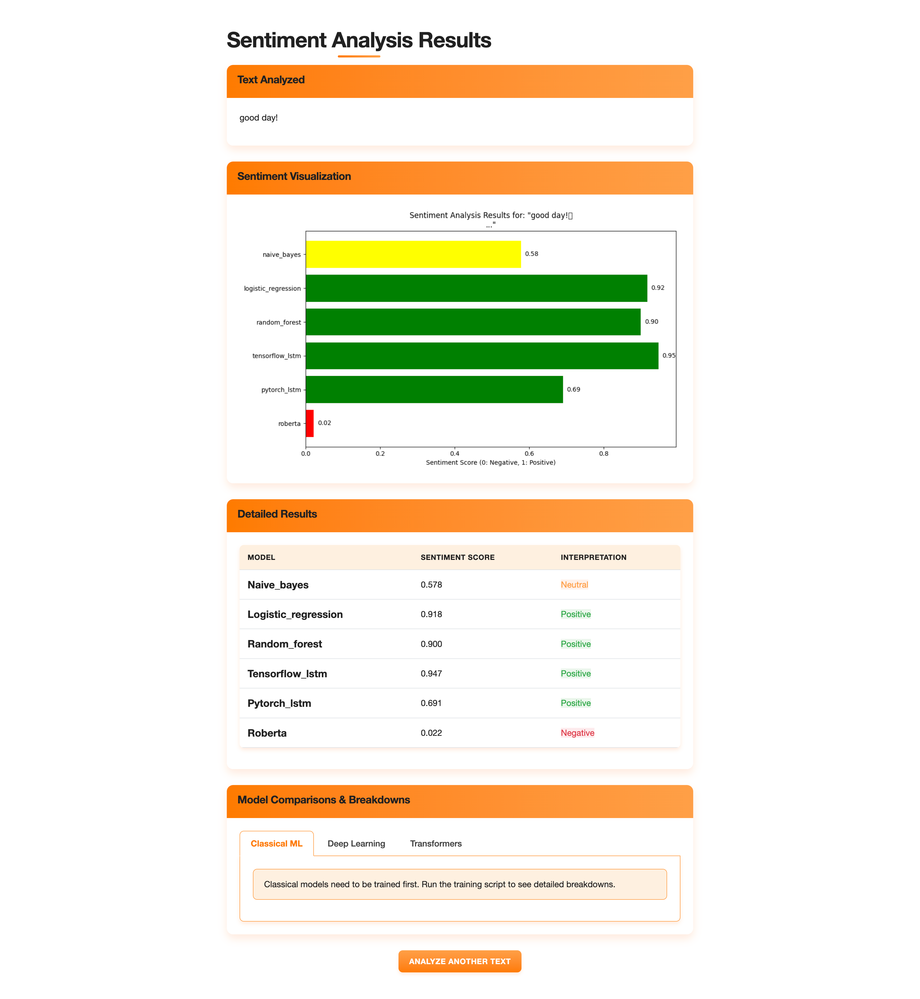

# Sentiment Analysis Web Tool



## Overview

A web-based application for analyzing the sentiment of text using multiple machine learning and deep learning algorithms. This tool provides a comparative view of how different models interpret sentiment, with detailed breakdowns of their analysis processes.

## Features

- **Multi-model Analysis**: Compare results from different algorithm types:
  - Classical ML Models (Naive Bayes, Logistic Regression, Random Forest)
  - Deep Learning Models (LSTM networks)
  - Transformer Models (BERT, RoBERTa)
- **Detailed Breakdowns**: Understand how each model arrives at its sentiment classification

  - Feature importance for classical models
  - Token analysis for transformers
  - Important segments for LSTM models

- **User-Friendly Interface**: Modern, responsive UI with:

  - Real-time word count tracking
  - Clear result visualization
  - Interactive model comparison

- **Visual Results**: See sentiment scores plotted for easy comparison

## Screenshots

- **Input Screen**: Clean interface with a text area for entering content to analyze
- **Results Screen**: Comparative view of model predictions with detailed breakdowns for each algorithm

## Installation

1. Clone the repository:

   ```bash
   git clone https://github.com/AhmerMH/sentiment-analysis.git
   cd sentiment-analysis
   ```

2. Create a virtual environment:

   ```bash
   python -m venv venv
   source venv/bin/activate  # On Windows: venv\Scripts\activate
   ```

3. Install dependencies:

   ```bash
   pip install -r requirements.txt
   ```

4. Download necessary model files (if not included):
   ```bash
   python download_models.py
   ```

## Usage

1. Start the application:

   ```bash
   python app.py
   ```

2. Open your browser and navigate to:

   ```
   http://localhost:5000
   ```

3. Enter text (up to 200 words) in the input field and click "Analyze Sentiment"

4. View the comparative results from different models

## Model Training

Some models require training before they can provide detailed breakdowns:

```bash
python train_models.py
```

This will train the classical ML models and deep learning models on sentiment datasets.

## How It Works

### Classical ML Models

These models use statistical patterns and word frequencies to determine sentiment. They provide feature importance to show which words contributed most to the classification.

### Deep Learning (LSTM) Models

These models analyze text sequences, maintaining context through recurrent neural networks. They can understand longer-range dependencies in text.

### Transformer Models

State-of-the-art models like BERT and RoBERTa use attention mechanisms to understand the relationships between words, regardless of their position in the text.

## Project Structure

```
sentiment-analysis/
├── app/
│   ├── models/
│   │   ├── classical_models.py
│   │   ├── deep_learning_models.py
│   │   └── transformer_models.py
│   ├── static/
│   │   ├── css/
│   │   │   └── styles.css
│   │   └── js/
│   ├── templates/
│   │   ├── index.html
│   │   └── results.html
│   ├── views.py
│   └── __init__.py
├── data/
├── app.py
├── requirements.txt
├── train_models.py
└── README.md
```

## Technologies Used

- **Backend**: Python, Flask
- **Machine Learning**: scikit-learn, TensorFlow, PyTorch, Hugging Face Transformers
- **Frontend**: HTML, CSS, JavaScript, Bootstrap, Chart.js
- **Data Processing**: NLTK, pandas, numpy

## Contributing

Contributions are welcome! Please feel free to submit a Pull Request.

1. Fork the repository
2. Create your feature branch (`git checkout -b feature/amazing-feature`)
3. Commit your changes (`git commit -m 'Add some amazing feature'`)
4. Push to the branch (`git push origin feature/amazing-feature`)
5. Open a Pull Request

## License

This project is licensed under the MIT License - see the LICENSE file for details.

## Acknowledgements

- Hugging Face for transformer models
- scikit-learn for classical ML algorithms
- TensorFlow and PyTorch for deep learning capabilities
